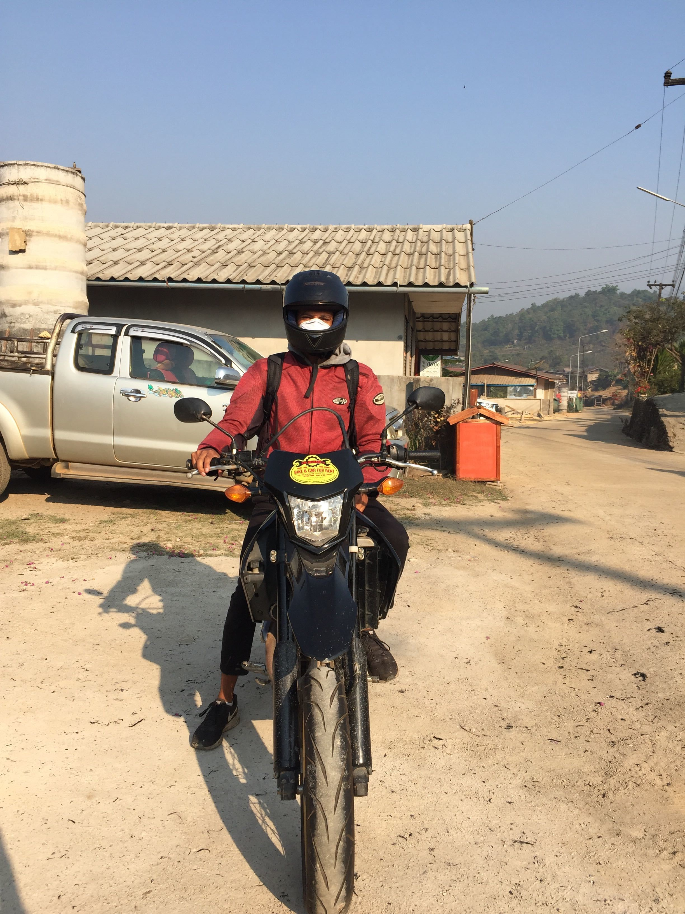

Reporting from Chiang mai in Thailand.

I've been thinking alot about my traveling lately and some pros and cons to it that I'll talk about.

I think a lot of people hear the word <b>solo</b> traveling and get scared of being alone. But there is no easier way of making friends than travling solo and staying in hostels with other backpackers.
There are so many people doing the same thing as you are. Everyone is reaching out trying to make new friends, as you are.
And as everyone is doing the trip of their life, they are going to be happy all the time, as you will be. (90% of the time all the time). 

One thing I enjoy alot is the flexibility of doing whatever you want, whenever you want. If I feel like renting a bike and riding in the mountains for three days.
I'll do it, whether or not someone is joining me. And it was amazing, highly recommend it.

<small style="">Ban Rak Thai, border to Myanmar</small>

There are some downsides too, it's great experiencing everything that I do, but sometimes I really feel like I want to experience it with someone, share the memories and talk about them afterwards.

Or having to say goodbye to all the nice people I meet. That part can be really hard. Sometimes when I've been traveling with someone for a while I get comfortable, and enjoying their company a lot. Leaving them feels like starting over from scratch, which can be tough. 

> We need to learn to let go, everything has to have an end to it. Otherwise we'll not be able to experience new great things.

A quote from a wise friend I met in Bali after talking about how hard it is to leave people or places that you really like.

I've made friends all over the world, and I'm super happy I met them all. It really gives me perspective to life interacting with people from different countries and cultures. It reminds me how small Sweden really is, and how small our problems are compared to the rest of the world.

That's all for me folks. On friday I'm flying to Cambodia, starting in Siem Reap.

See you later refrigerator.